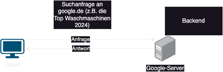

# **My-Wiki-Tech**
## **Frontend vs. Backend**
*Frontend* : Die Ansicht für den Benutzer/Benutzeroberfläche, Design und Layout. Interaktionen des Benutzers
*Backend*: Der Benutzer sieht die Backend Services nicht bzw. interagiert damit nicht direkt
*Client*: Das Benutzerendgerät
*Server*: ist ein Gerät, das Anfragen von Clients verarbeitet und die angeforderten Dienste bereitstellt

**Internet**
Internet: Globales Netzwerk, welches die weltweite Kommunikation ermöglicht durch den Zusammenschluss von Servern ermöglicht.

**Pfade**
absoluter Pfad: Geht von dem Ursprung des Dateisystems aus (auf Windows wäre das C://)
relativer Pfad:Geht von dem Verzeichnis aus, in welchem ihr euch befindet. Startet mit ./
Entwicklungsumgebung
**IDE**
: Die Applikation, in welcher ihr den Code entwickelt. Visual Studio Code wäre ein Beispiel
**Software vs. Hardware**
Software: Programm/Anwendungen. Man kann Software nicht anfassen
Hardware: Physische Komponenten des Computers/Server. Zum Beispiel CPU wäre eine Hardware Komponente
**Betriebssystem** bzw. OS: Windows, Android, iOS. Schnittstelle zwischen Hardware und Software
**Hardware Komponenten**
### **CPU**: Central Processing Unit - Prozessor

### **RAM**: 
Random Access Memory - Arbeitsspeicher. Kurzzeitspeicher

 ### **WSL** : 
 (Windows Subsystem for Linux) is a compatibility layer that allows you to run Linux distributions natively on Windows. It enables developers to use Linux command-line tools, scripts, and applications directly on a Windows machine without the need for a virtual machine or dual booting.

**IDE**(Integrated Development Environment):
ist eine Software, die Programmierer beim Entwickeln von Anwendungen unterstützt. Sie bietet eine Vielzahl von Tools und Funktionen, die in einer einzigen Benutzeroberfläche integriert sind, um das Schreiben, Debuggen und Verwalten von Code zu erleichtern.

**PowerShell** is a powerful scripting language and command-line shell developed by Microsoft. It is primarily designed for system administrators and power users to automate tasks, configure systems, and manage servers and workstations.See:

**SSD**: (Solid State Drive) is a type of data storage device that uses flash memory to store information, offering faster read/write speeds, lower power consumption, and better durability compared to traditional Hard Disk Drives (HDDs). SSDs have no moving parts, making them more reliable and quieter.

## **Network technologies**
### WAN: Wide Area Network
-Connects multiple LANs on a large geographical area (cities, countries and continents)
-Enables communication and resource sharing across long distances
- Uses optic cables, fiber, satellite links or leased telecom.lines 
-Slower compared to LAN -> distance

### MAN: Metropolitan Area Network
-covers a city or a large campus (with different geographic locations of institutes)
-connects LANs in a metropolitan area
-Aims efficient communication  and sharing resources 

### LAN: Local Area Network
-Network -> Connects computers, devices in small area (Home, office, school or university).
-Allows resource sharing (e.g., printers, files) and fast communication. 
-LANs use wired (Ethernet) or wireless (WLAN) connections (radio waves transmission)
-typically private or  used in a single organization. 
-fast, inexpensive and perfect for localized networking needs.

### PAN: Personal Area Network
-connects devices in a very short range (one person) ~ a fews meters
-Allows communication between personal devices (Bluetooth, Wireless headphones, smart watch synchronisation with smartphone)
-covers very small range few meters  
-Uses infrared or Bluetooth technologies 

### ICMP: Internet Control Message Protocol
Is a protocol used to check if a packet of data has reached its destination or target.
Very important in error testing and reporting 
an example of usage of ICMP on network devices like the router 

It is located in level 3 of the OSI model

### ARP: Adress Resolution Protocol
It is a network protocol that is used to assign IP addresses to physical MAC addresses in a local network.
It works on layer 2 of the OSI model and allows devices to find the correct physical address on the network in order to transmit data packets efficiently

### MAC: Media Address Control
MAC address is a permanent, physical address that is assigned to the computer's network card.

### IP: Interenet Protocol
provides a logic address
internal addresses are provided from router 
external are assigned from ISP(internet service provider)
### DHCP: Dynamic Host Configuration Protocol

### NIC: Network Internet Card
It can only provide one network connection 
has exactly one permanent MAC address

### Ports 
Decide which service or program a package is addressed to
A PC has 65.535 prts à 16 bits 

### Subnet masks
The purpose of a standard subnet mask is to divide networks and IP addresses into smaller segments.
This makes it easier to manage larger networks through the subnet and data traffic can be sent in a targeted manner.
It shows which part of the IP addresses belongs to the network and which is reserved for the devices.
It is always written in four blocks of numbers, just like an IP address.
The more ones there are in the binary representation, the smaller the usable address range will be. 

### How does routing work if one wants to reach an external address?
The device in the internal network sends a request to the router.
It reaches te router. The router checks in its routing list of servers. 
It selects the path to the next closest server. It looks for the optimal transfer of data package:
shortest distances and fastest transfer. 
THe user request reaches the target server or destination. The reply to the request takes the way back to the sender.
The way back is not necessarily the same as the away 

